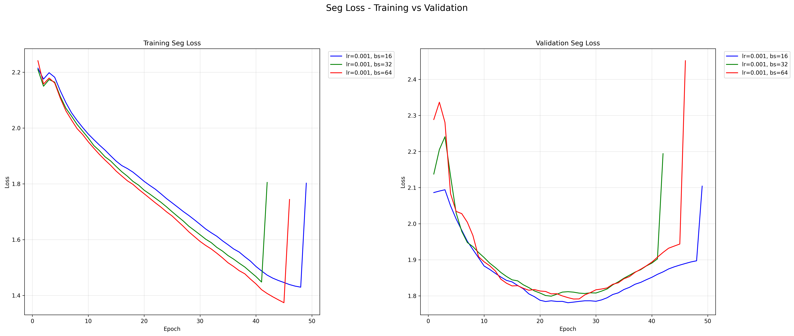
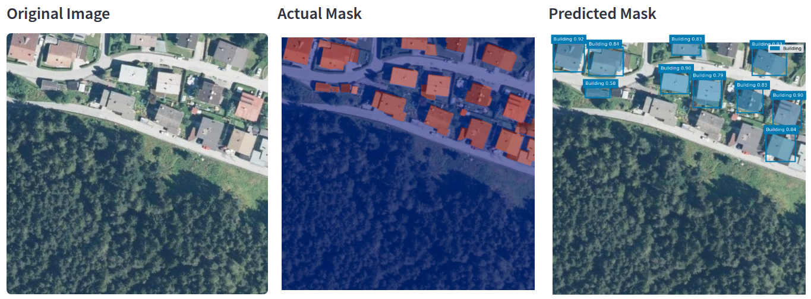
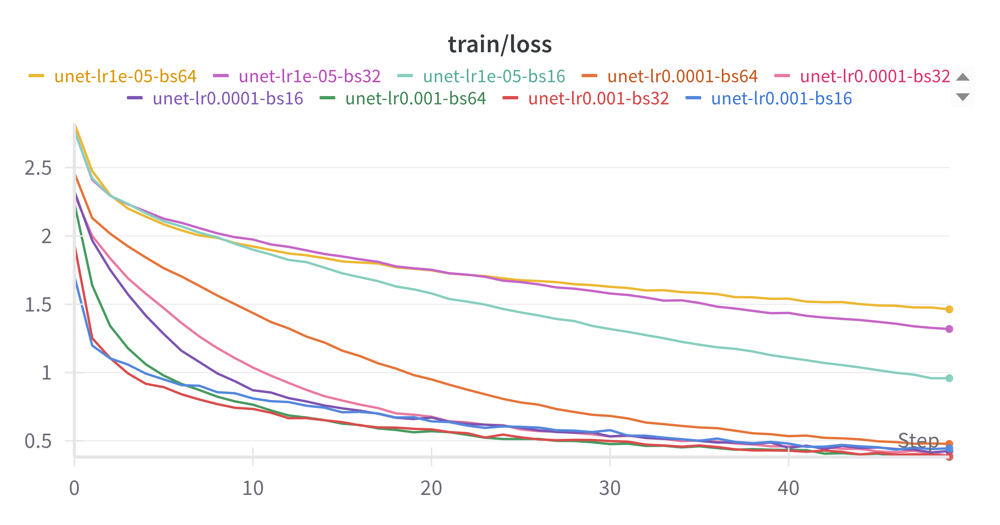
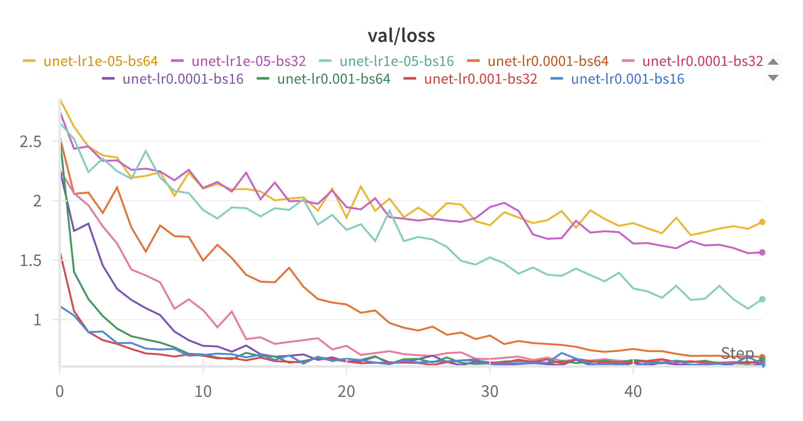
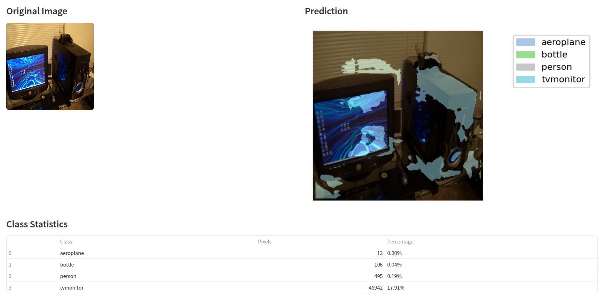
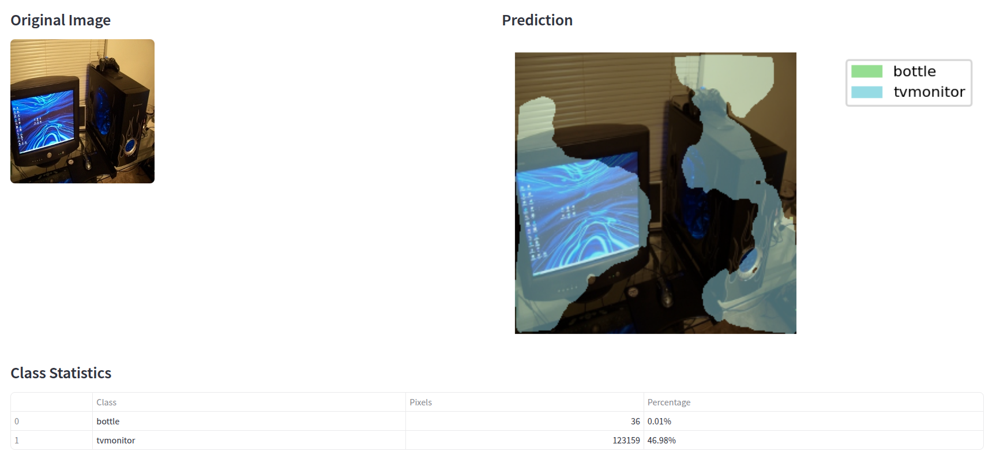

# segmentation-playground

https://github.com/soumendra/segmentation-playground

# Experiment Results

## 1. YOLOv8 Image Instance Segmentation

**Model:** YOLOv8 Segmentation (Ultralytics)

## Dataset

* **Dataset:** Buildings
* **Classes:** 2 (Including Background)

## Training Configuration

| Parameter     | Value             |
| ------------- | ----------------- |
| Epochs        | 50                |
| Batch Size    | 16, 32, 64        |
| Learning Rate | 1e-3, 1e-4, 1e-5  |
| Optimizer     | AdamW             |
| Model         | yolov8            |
| Input Size    | 640 x 640         |

## Loss Analysis

## Key Observations

* Training loss starts going up after 40 epochs, whereas the validation loss starts increasing after 25 epochs, indicating the model starts to overfit post that.

## Sample Visualization

**The best performing model - lr : 0.001, batch_size : 16**

## 2. UNET Image Semantic Segmentation

**Model:** UNET Sematic Segmentation (Pytorch)

## Dataset

* **Dataset:** PASCAL VOC
* **Classes:** 21 (Including Background)

## Training Configuration

| Parameter     | Value             |
| ------------- | ----------------- |
| Epochs        | 50                |
| Batch Size    | 16, 32, 64        |
| Learning Rate | 1e-3, 1e-4, 1e-5  |
| Optimizer     | AdamW             |
| Model         | UNET              |
| Input Size    | 512 x 512         |

## Loss Analysis

## Key Observations

* Training and Validation loss starts stabilizing after 40 epochs.

## Sample Visualization

**The best performing model - epochs: 50, lr : 0.001, batch_size : 32**

**The best performing model - epochs: 200, lr : 0.001, batch_size : 32**

