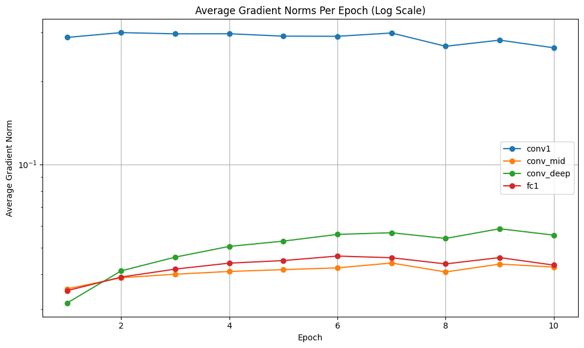
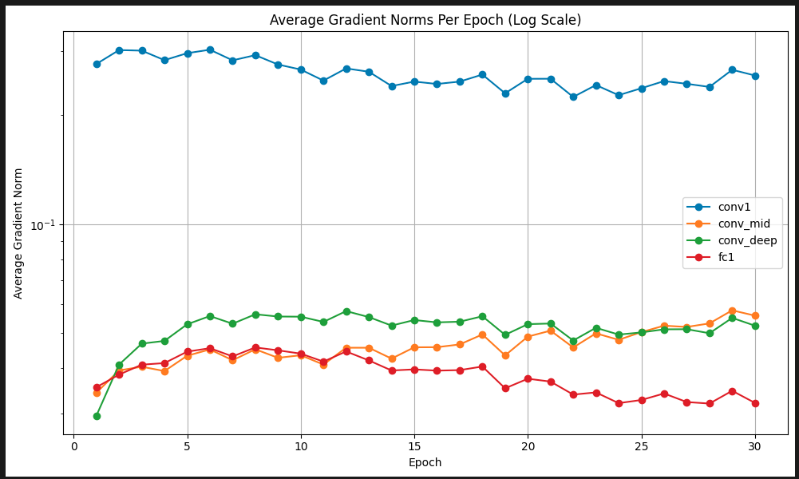

# Gradient Vanishing Analysis in VGG19
This notebook tracks and compares **average gradient norms per epoch** across multiple layers in VGG19 to observe potential vanishing gradients.

### Layers tracked:
- `features[0]`: Early convolutional layer
- `features[10]`: Mid-level convolutional layer
- `features[28]`: Deep convolutional layer
- `classifier[0]`: First fully connected layer

*Generated on: 2025-05-11*


```python
import torch
import torch.nn as nn
import torchvision.models as models
import torchvision.transforms as transforms
import torchvision.datasets as datasets
from torch.utils.data import DataLoader
import matplotlib.pyplot as plt
import numpy as np
import os
from tqdm import tqdm

device = torch.device('cuda' if torch.cuda.is_available() else 'cpu')
```


```python
# Load pretrained VGG19 and modify classifier
vgg19 = models.vgg19(pretrained=True)
vgg19.classifier[6] = nn.Linear(4096, 10)

for module in vgg19.modules():
    if isinstance(module, nn.ReLU):
        module.inplace = False
        
vgg19 = vgg19.to(device)
```

    /workspace/projects/dl-lab-notebooks/.venv/lib/python3.12/site-packages/torchvision/models/_utils.py:208: UserWarning: The parameter 'pretrained' is deprecated since 0.13 and may be removed in the future, please use 'weights' instead.
      warnings.warn(
    /workspace/projects/dl-lab-notebooks/.venv/lib/python3.12/site-packages/torchvision/models/_utils.py:223: UserWarning: Arguments other than a weight enum or `None` for 'weights' are deprecated since 0.13 and may be removed in the future. The current behavior is equivalent to passing `weights=VGG19_Weights.IMAGENET1K_V1`. You can also use `weights=VGG19_Weights.DEFAULT` to get the most up-to-date weights.
      warnings.warn(msg)


```python
trainable_params = sum(p.numel() for p in vgg19.parameters() if p.requires_grad)
print(f"Trainable parameters: {trainable_params:,}")
```

    Trainable parameters: 139,611,210


```python
# Gradient storage
epoch_gradients = {
    'conv1': [], 'conv_mid': [], 'conv_deep': [], 'fc1': []
}
batch_grads = {'conv1': [], 'conv_mid': [], 'conv_deep': [], 'fc1': []}

# Hook function
def register_hook(module, name):
    def hook(module, grad_input, grad_output):
        if grad_output[0] is not None:
            batch_grads[name].append(grad_output[0].norm().item())
    module.register_full_backward_hook(hook)

# Register hooks
register_hook(vgg19.features[0], 'conv1')
register_hook(vgg19.features[10], 'conv_mid')
register_hook(vgg19.features[28], 'conv_deep')
register_hook(vgg19.classifier[0], 'fc1')
```


```python
# CIFAR-10 loading
transform = transforms.Compose([
    transforms.Resize((224, 224)),
    transforms.ToTensor()
])
train_dataset = datasets.CIFAR10(root='../data', train=True, transform=transform, download=True)
train_loader = DataLoader(train_dataset, batch_size=32, shuffle=True)
```


```python
# Loss and optimizer
criterion = nn.CrossEntropyLoss()
optimizer = torch.optim.Adam(vgg19.parameters(), lr=1e-4)
```


```python
# Train for 10 epochs and log average gradient norms
for epoch in tqdm(range(10)):
    for images, labels in train_loader:
        images, labels = images.to(device), labels.to(device)
        optimizer.zero_grad()
        outputs = vgg19(images)
        loss = criterion(outputs, labels)
        loss.backward()
        optimizer.step()
    # Store average gradient per layer for this epoch
    for layer in batch_grads:
        avg_grad = np.mean(batch_grads[layer]) if batch_grads[layer] else 0
        epoch_gradients[layer].append(avg_grad)
        batch_grads[layer].clear()
    print(f"Epoch {epoch+1} complete")
```

     10%|█         | 1/10 [03:34<32:14, 214.98s/it]

    Epoch 1 complete


     20%|██        | 2/10 [07:08<28:31, 213.91s/it]

    Epoch 2 complete


     30%|███       | 3/10 [10:41<24:54, 213.53s/it]

    Epoch 3 complete


     40%|████      | 4/10 [14:15<21:22, 213.69s/it]

    Epoch 4 complete


     50%|█████     | 5/10 [17:48<17:48, 213.64s/it]

    Epoch 5 complete


     60%|██████    | 6/10 [21:22<14:14, 213.71s/it]

    Epoch 6 complete


     70%|███████   | 7/10 [24:57<10:42, 214.15s/it]

    Epoch 7 complete


     80%|████████  | 8/10 [28:31<07:08, 214.04s/it]

    Epoch 8 complete


     90%|█████████ | 9/10 [32:04<03:33, 213.86s/it]

    Epoch 9 complete


    100%|██████████| 10/10 [35:38<00:00, 213.83s/it]

    Epoch 10 complete


    


```python
# Plot average gradient norms per epoch for each layer
plt.figure(figsize=(10, 6))
for layer, grads in epoch_gradients.items():
    plt.plot(range(1, len(grads)+1), grads, label=layer, marker='o')
plt.title("Average Gradient Norms Per Epoch (Log Scale)")
plt.xlabel("Epoch")
plt.ylabel("Average Gradient Norm")
plt.yscale("log")
plt.legend()
plt.grid(True)
plt.tight_layout()
plt.show()
```


    

    


**30 epochs**



**Summary**

| Layer       | Behavior                      | Why                                            |
| ----------- | ----------------------------- | ---------------------------------------------- |
| `conv1`     | High and stable gradient norm | Actively adapting pretrained low-level filters |
| `conv_mid`  | Moderate and stable growth    | Gradually tuning mid-level features            |
| `conv_deep` | Lower and flatter             | Already well-aligned or slower to adjust       |
| `fc1`       | Gradually vanishing           | Far from input + minimal updates needed        |


**Conclusion**

- Observing vanishing gradients behavior in `VGG19` is not straight forward as seen during training CIFAR-10, with my guess being, that the model is not deep enough to demonstrate this behavior.
- Even though fc1 is seen to gradually vanish, it is still far from concluding that the gradients are completely diminished.
- This difference can be clearly seen in `RESNET50` model (with vs without skip connection), as the model is deep enough to understand the vanishing gradient issue 


