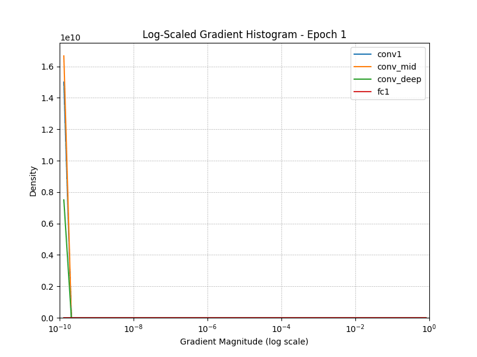

# Gradient Vanishing Analysis in VGG38

### Motivation

After failing to observe vanishing gradients in `VGG19` network, we want to understand if the network's depth has a role to play in observing this behavior. So wwe will go ahead and train a even deeper VGG19 network.

### Approach

Just like our previous experiments we will track different layers to understand the gradient behavior and the only difference is the no.of layers in the network. We will have 38 trainable layers and the corresponding layers - early, mid, deep and FC that we track will change accordingly.

#### Layers tracked:
- `features[0]`: Early convolutional layer
- `features[20]`: Mid-level convolutional layer
- `features[-4]`: Deep convolutional layer
- `classifier[0]`: First fully connected layer

**Import libraries**


```python
import torch
import torch.nn as nn
import torchvision.models as models
import torchvision.transforms as transforms
import torchvision.datasets as datasets
from torch.utils.data import DataLoader
import matplotlib.pyplot as plt
import numpy as np
import os
from tqdm import tqdm
from scipy.stats import gaussian_kde
from matplotlib.animation import FuncAnimation


device = torch.device('cuda' if torch.cuda.is_available() else 'cpu')
```

**Load VGG19 pretrained model**


```python
# Load pretrained VGG19 and modify classifier
vgg19 = models.vgg19(pretrained=True)
vgg19.classifier[6] = nn.Linear(4096, 10)

for module in vgg19.modules():
    if isinstance(module, nn.ReLU):
        module.inplace = False
        
vgg19 = vgg19.to(device)
```


```python
class DoubleConvVGG19(nn.Module):
    def __init__(self, num_classes=1000):
        super(DoubleConvVGG19, self).__init__()
        
        original_vgg = models.vgg19(pretrained=True)
        original_layers = list(original_vgg.features)

        new_features = []
        for layer in original_layers:
            if isinstance(layer, nn.Conv2d):
                # Original conv + relu
                new_features.append(layer)
                new_features.append(nn.ReLU(inplace=True))
                
                # Duplicated conv + relu (same output channels as original)
                dup_conv = nn.Conv2d(
                    in_channels=layer.out_channels,
                    out_channels=layer.out_channels,
                    kernel_size=layer.kernel_size,
                    stride=layer.stride,
                    padding=layer.padding,
                    bias=(layer.bias is not None)
                )
                nn.init.kaiming_normal_(dup_conv.weight, mode='fan_out', nonlinearity='relu')
                new_features.append(dup_conv)
                new_features.append(nn.ReLU(inplace=True))

            elif isinstance(layer, nn.ReLU):
                # Already added relu after conv, skip
                continue
            else:
                # e.g., MaxPool or other layers
                new_features.append(layer)

        self.features = nn.Sequential(*new_features)
        self.avgpool = original_vgg.avgpool

        # Custom classifier (optional)
        self.classifier = nn.Sequential(
            nn.Linear(512 * 7 * 7, 4096),
            nn.ReLU(True),
            nn.Dropout(),
            nn.Linear(4096, 4096),
            nn.ReLU(True),
            nn.Dropout(),
            nn.Linear(4096, num_classes),
        )

    def forward(self, x):
        x = self.features(x)
        x = self.avgpool(x)
        x = torch.flatten(x, 1)
        x = self.classifier(x)
        return x
```


```python
vgg38 = DoubleConvVGG19(num_classes=10)

for module in vgg38.modules():
    if isinstance(module, nn.ReLU):
        module.inplace = False
        
vgg38 = vgg38.to(device)
```

**Verify no. of parameters to be trained**


```python
trainable_params = sum(p.numel() for p in vgg38.parameters() if p.requires_grad)
print(f"Trainable parameters: {trainable_params:,}")
```

    Trainable parameters: 161,219,018


**Register backward hook to log gradients**


```python
# Gradient storage
epoch_gradients = {
    'conv1': [], 'conv_mid': [], 'conv_deep': [], 'fc1': []
}
batch_grads = {'conv1': [], 'conv_mid': [], 'conv_deep': [], 'fc1': []}

# Hook function
def register_hook(module, name):
    def hook(module, grad_input, grad_output):
        if grad_output[0] is not None:
            batch_grads[name].append(grad_output[0].norm().item())
    module.register_full_backward_hook(hook)

# Register hooks
register_hook(vgg38.features[0], 'conv1')
register_hook(vgg38.features[20], 'conv_mid')
register_hook(vgg38.features[-4], 'conv_deep')
register_hook(vgg38.classifier[0], 'fc1')
```

**Load CIFAR10 data and apply trasnformations**


```python
# CIFAR-10 loading
transform = transforms.Compose([
    transforms.Resize((224, 224)),
    transforms.ToTensor()
])
train_dataset = datasets.CIFAR10(root='../data', train=True, transform=transform, download=True)
train_loader = DataLoader(train_dataset, batch_size=32, shuffle=True)
```

**Define loss and optimizer**


```python
# Loss and optimizer
criterion = nn.CrossEntropyLoss()
optimizer = torch.optim.Adam(vgg38.parameters(), lr=1e-4)
```

**Train the model and randomly log 20 gradients for each epoch per layer**


```python
# Train for 10 epochs and log average gradient norms
for epoch in tqdm(range(10)):
    for images, labels in train_loader:
        images, labels = images.to(device), labels.to(device)
        optimizer.zero_grad()
        outputs = vgg38(images)
        loss = criterion(outputs, labels)
        loss.backward()
        optimizer.step()
    
    # For each layer, sample 20 values from collected gradients
    for layer in batch_grads:
        grads = batch_grads[layer]
        if len(grads) >= 20:
            sampled = np.random.choice(grads, 20, replace=False)
        else:
            sampled = np.pad(grads, (0, 20 - len(grads)), constant_values=0)
        epoch_gradients[layer].append(sampled)
        batch_grads[layer].clear()

    print(f"Epoch {epoch+1} complete")
```

    100%|██████████| 10/10 [1:05:55<00:00, 395.56s/it]

    Epoch 10 complete


    


```python

layers = ['conv1', 'conv_mid', 'conv_deep', 'fc1']
```


```python
def create_log_hist_animation_matplotlib(epoch_gradients, layers, num_epochs=10, save_path='log_hist_gradients.gif'):
    fig, ax = plt.subplots(figsize=(8, 6))

    # Log-spaced bins from 1e-10 to 1e0 (1)
    log_bins = np.logspace(-10, 0, 50)

    def update(epoch):
        ax.clear()
        for layer in layers:
            data = epoch_gradients[layer][epoch]
            if len(data) > 1 and np.isfinite(data).all():
                log_data = np.abs(data) + 1e-10  # Avoid log(0)
                hist, bins = np.histogram(log_data, bins=log_bins, density=True)
                bin_centers = (bins[:-1] + bins[1:]) / 2
                ax.plot(bin_centers, hist, label=layer)

        ax.set_xscale('log')
        ax.set_xlim(1e-10, 1)
        ax.set_ylim(0, None)
        ax.set_title(f"Log-Scaled Gradient Histogram - Epoch {epoch + 1}")
        ax.set_xlabel("Gradient Magnitude (log scale)")
        ax.set_ylabel("Density")
        ax.legend()
        ax.grid(True, which="both", ls="--", linewidth=0.5)

    ani = FuncAnimation(fig, update, frames=num_epochs, repeat=False)
    ani.save(save_path, writer='pillow', fps=1)
    print(f"Saved animation to {save_path}")

```


```python
create_log_hist_animation_matplotlib(epoch_gradients, layers, num_epochs=10, save_path='log_hist_gradients_vgg38.gif')
```

    Saved animation to log_hist_gradients_vgg38.gif




**Observations**

- The graph shows how the distribution of gradient magnitudes (on a log scale) evolves across epochs for each layer.
- Here as opposed to VGG19 layer gradients, the gradient magnitude is close to 1e-10, which is very low and cannot contribute any further to weight updation.
- This does prove that as we make the VGG19 network deeper, the `vanishing gradient` behavior becomes clearly visible even when the model is trained for few epochs.


