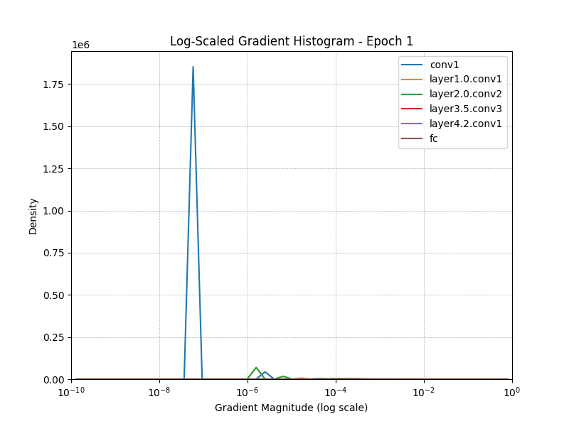

# Gradient Vanishing Analysis in RESNET50 without skip connections

### Motivation

Moving on from `VGG19` and `VGG38` network we wish to explore more deeper network in `RESNET50` and see how the nuances in this architecture changes gradient behavior.

### Approach

Before training the RESNET50 in its original form, we slightly modify the architecture by taking the skip connections out.

The reason we do this is because we understand that skip connections play a big role in tackling the vanishing gradients issue and also allow us to train deeper network.

#### Layers tracked:
- `conv1`: Early convolutional layer
- `layer1.0.conv1`: Mid-level convolutional layer
- `layer2.0.conv2`: Mid-level convolutional layer
- `layer3.5.conv3`: Deep convolutional layer
- `fc`: First fully connected layer

**Import libraries**


```python
import torch
import torch.nn as nn
from torchvision import datasets, transforms
from torch.utils.data import DataLoader
import matplotlib.pyplot as plt
from tqdm import tqdm
import numpy as np
from collections import defaultdict
from scipy.stats import gaussian_kde
from matplotlib.animation import FuncAnimation
```

**Load RESNET50 model without skip connections**


```python
class Bottleneck(nn.Module):
    expansion = 4

    def __init__(self, in_planes, planes, stride=1, skip=True):
        super(Bottleneck, self).__init__()
        self.skip = skip

        self.conv1 = nn.Conv2d(in_planes, planes, kernel_size=1, bias=False)
        self.bn1 = nn.BatchNorm2d(planes)

        self.conv2 = nn.Conv2d(planes, planes, kernel_size=3, stride=stride, padding=1, bias=False)
        self.bn2 = nn.BatchNorm2d(planes)

        self.conv3 = nn.Conv2d(planes, self.expansion * planes, kernel_size=1, bias=False)
        self.bn3 = nn.BatchNorm2d(self.expansion * planes)

        self.relu = nn.ReLU(inplace=True)

        self.downsample = None
        if stride != 1 or in_planes != self.expansion * planes:
            self.downsample = nn.Sequential(
                nn.Conv2d(in_planes, self.expansion * planes, kernel_size=1, stride=stride, bias=False),
                nn.BatchNorm2d(self.expansion * planes)
            )

    def forward(self, x):
        identity = x

        out = self.relu(self.bn1(self.conv1(x)))
        out = self.relu(self.bn2(self.conv2(out)))
        out = self.bn3(self.conv3(out))

        if self.skip:
            if self.downsample is not None:
                identity = self.downsample(identity)
            out = out + identity

        return self.relu(out)


class CustomResNet50(nn.Module):
    def __init__(self, skip=True, num_classes=200):  # Tiny ImageNet = 200 classes
        super(CustomResNet50, self).__init__()
        self.in_planes = 64

        # Original ResNet-style downsampling for 64x64 input
        self.conv1 = nn.Conv2d(3, 64, kernel_size=7, stride=2, padding=3, bias=False)
        self.bn1 = nn.BatchNorm2d(64)
        self.relu = nn.ReLU(inplace=True)
        self.maxpool = nn.MaxPool2d(kernel_size=3, stride=2, padding=1)

        self.layer1 = self._make_layer(64, 3, skip)
        self.layer2 = self._make_layer(128, 4, skip, stride=2)
        self.layer3 = self._make_layer(256, 6, skip, stride=2)
        self.layer4 = self._make_layer(512, 3, skip, stride=2)

        self.avgpool = nn.AdaptiveAvgPool2d((1, 1))
        self.fc = nn.Linear(512 * Bottleneck.expansion, num_classes)

    def _make_layer(self, planes, blocks, skip, stride=1):
        layers = [Bottleneck(self.in_planes, planes, stride, skip)]
        self.in_planes = planes * Bottleneck.expansion
        for _ in range(1, blocks):
            layers.append(Bottleneck(self.in_planes, planes, skip=skip))
        return nn.Sequential(*layers)

    def forward(self, x):
        x = self.relu(self.bn1(self.conv1(x)))
        x = self.maxpool(x)

        x = self.layer1(x)
        x = self.layer2(x)
        x = self.layer3(x)
        x = self.layer4(x)

        x = self.avgpool(x)
        x = torch.flatten(x, 1)
        x = self.fc(x)
        return x


model = CustomResNet50(skip=False).cuda()
```

**Verify no. of trainable parameters**


```python
trainable_params = sum(p.numel() for p in model.parameters() if p.requires_grad)
print(f"Trainable parameters: {trainable_params:,}")
```

    Trainable parameters: 23,917,832


**Register backward hook to log gradients**


```python
selected_layers = ["conv1", "layer1.0.conv1", "layer2.0.conv2", "layer3.5.conv3", "layer4.2.conv1", "fc"]
gradients = {}

def register_hooks(model):
    for name, module in model.named_modules():
        if name in selected_layers and (isinstance(module, nn.Conv2d) or isinstance(module, nn.Linear)):
            gradients[name] = []
            def hook(module, grad_input, grad_output, name=name):
                gradients[name].append(grad_output[0].norm().item())
            module.register_full_backward_hook(hook)

register_hooks(model)
```


```python
transform = transforms.Compose([
    transforms.Resize((224, 224)),
    transforms.ToTensor(),
    transforms.Normalize(mean=[0.485, 0.456, 0.406],
                         std=[0.229, 0.224, 0.225])
])
train_dataset = datasets.ImageFolder('../data/tiny-imagenet-200/train', transform=transform)

train_loader = DataLoader(train_dataset, batch_size=16, shuffle=True)

epoch_gradients = defaultdict(list)
```

**Define loss and optimizer**


```python
criterion = nn.CrossEntropyLoss()
# optimizer = torch.optim.Adam(model.parameters(), lr=0.001)
optimizer = torch.optim.SGD(model.parameters(), lr=0.1, momentum=0.9)
```

**Train the model**


```python
def train(model, epochs=1):
    model.train()
    for epoch in tqdm(range(epochs)):
        # Temporary storage for one epoch
        batch_grads = defaultdict(list)

        for inputs, labels in train_loader:
            inputs, labels = inputs.cuda(), labels.cuda()
            optimizer.zero_grad()
            outputs = model(inputs)
            loss = criterion(outputs, labels)
            loss.backward()
            optimizer.step()
        
            # After backward, batch-level gradients are in global `gradients`
            for layer in selected_layers:
                if gradients[layer]:
                    batch_grads[layer].extend(gradients[layer])
                    gradients[layer].clear()  # Clear for next batch

        # Sample 20 values (or pad with zeros if less) for this epoch
        for layer in selected_layers:
            layer_grads = batch_grads[layer]
            if len(layer_grads) >= 20:
                sampled = np.random.choice(layer_grads, 20, replace=False)
            else:
                sampled = np.pad(layer_grads, (0, 20 - len(layer_grads)), constant_values=0)
            epoch_gradients[layer].append(sampled.tolist())

        print(f"Epoch {epoch+1} complete")

```


```python
train(model, epochs=10)
```
     100%|██████████████| 10/10 [28:40<0:00, 172.79s/it]

    Epoch 10 complete


```python

layers = ['conv1', 'layer1.0.conv1', 'layer2.0.conv2', 'layer3.5.conv3', 'layer4.2.conv1', 'fc']
```


```python
def create_log_hist_animation_matplotlib(epoch_gradients, layers, num_epochs=10, save_path='log_hist_gradients.gif'):
    fig, ax = plt.subplots(figsize=(8, 6))

    # Log-spaced bins from 1e-10 to 1e0 (1)
    log_bins = np.logspace(-10, 0, 50)

    def update(epoch):
        ax.clear()
        for layer in layers:
            data = epoch_gradients[layer][epoch]
            if len(data) > 1 and np.isfinite(data).all():
                log_data = np.abs(data) + 1e-10  # Avoid log(0)
                hist, bins = np.histogram(log_data, bins=log_bins, density=True)
                bin_centers = (bins[:-1] + bins[1:]) / 2
                ax.plot(bin_centers, hist, label=layer)

        ax.set_xscale('log')
        ax.set_xlim(1e-10, 1)
        ax.set_ylim(0, None)
        ax.set_title(f"Log-Scaled Gradient Histogram - Epoch {epoch + 1}")
        ax.set_xlabel("Gradient Magnitude (log scale)")
        ax.set_ylabel("Density")
        ax.legend()
        ax.grid(True, which="both", ls="--", linewidth=0.5)

    ani = FuncAnimation(fig, update, frames=num_epochs, repeat=False)
    ani.save(save_path, writer='pillow', fps=1)
    print(f"Saved animation to {save_path}")

```


```python
# Step 3: Run it
create_log_hist_animation_matplotlib(epoch_gradients, layers, num_epochs=50, save_path='log_hist_gradients_without_skip_sgd_50_epoch_normalized.gif')
```



**Observations**

- The graph shows how the distribution of gradient magnitudes (on a log scale) evolves across epochs for each layer.
- As we can see the for each of the considered layers, the gradient magnitude lies between 1e-4 to 1e-2, which is not low enough to classify this as vanishing gradient problem.
- The key thing to note in the above experiment is that we have trained the network using a `tiny imagenet` dataset and modifying the optimizer to `SGD` instead of `Adam`. The dataset was changed because `CIFA-10` image sizes are too small to train such a deep network and SGD is used because Adam's adaptive nature might mask the effects of vanishing gradients.
- Next up, lets put the skip connection back and train the model again to observe the gradient behavior.


