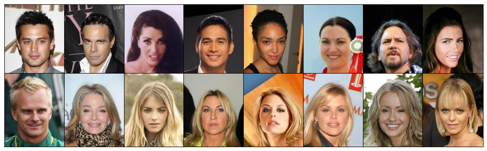
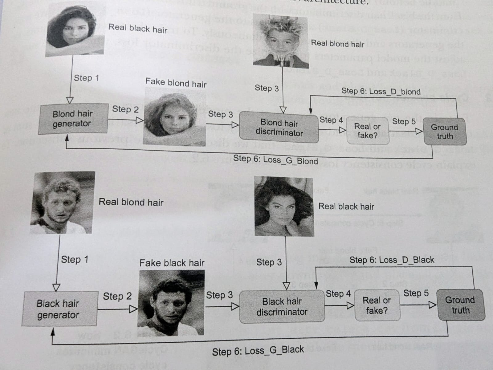
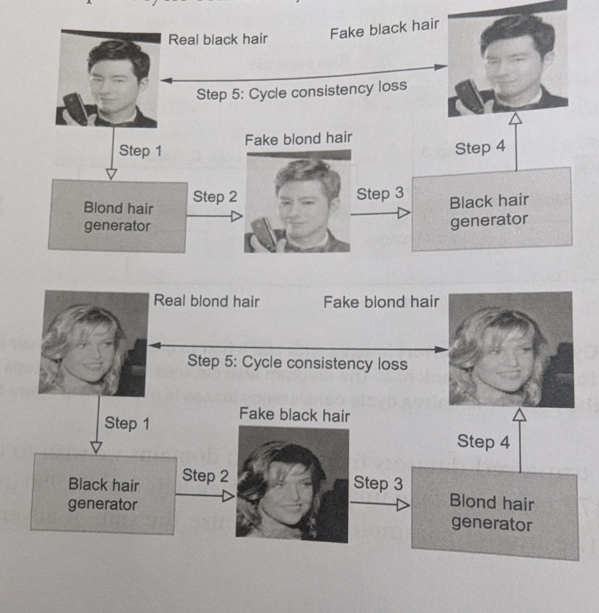
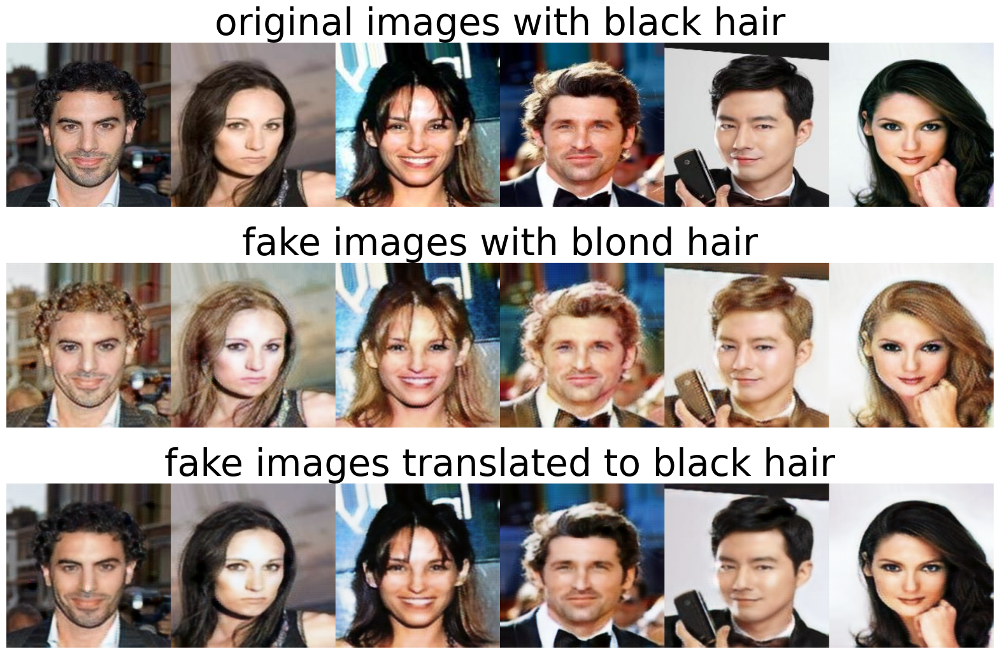
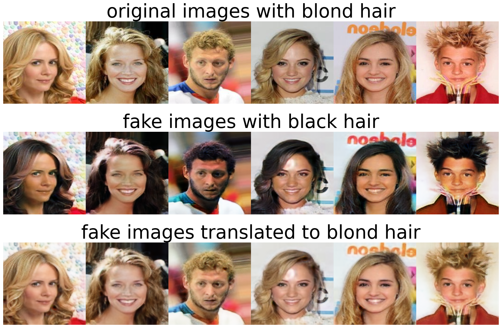

## CycleGAN

This notebook covers
* The idea behind CycleGAN and cycle consistency loss 
* Building a CycleGAN model to translate images from one domain to another 
* Training a CycleGAN by using any dataset with two domains of images
* Training a CycleGAN to convert black hair to blond hair and vice versa

### How do GANs work?

GANs consist of two neural networks competing against each other:

1. Generator (G): Creates fake data that tries to mimic real data
2. Discriminator (D): Tries to distinguish between real data and fake data generated by G

## 1. CycleGAN on Celebrity Faces Dataset
You can download the celebrity faces dataset is from Kaggle. Log into Kaggle and go to the link https://www.kaggle.com/datasets/jessicali9530/celeba-dataset to download dataset. 

**1.1 Load the data**


```python
import pandas as pd
import os, shutil

df=pd.read_csv("../../data/img_align_celeba/list_attr_celeba.csv")    #A
os.makedirs("../../data/black-blond/black", exist_ok=True)  
os.makedirs("../../data/black-blond/blond", exist_ok=True)    #B      
folder="../../data/img_align_celeba/img_align_celeba"
for i in range(len(df)):
    dfi=df.iloc[i]
    if dfi['Black_Hair']==1:    #C
        try:
            oldpath=f"{folder}/{dfi['image_id']}"
            newpath=f"../../data/black-blond/black/{dfi['image_id']}"
            shutil.move(oldpath, newpath)
        except:
            pass
    elif dfi['Blond_Hair']==1:    #D
        try:
            oldpath=f"{folder}/{dfi['image_id']}"
            newpath=f"../../data/black-blond/blond/{dfi['image_id']}"
            shutil.move(oldpath, newpath)
        except:
            pass
```


```python
trainA=r"../../data/black-blond/black/"
trainB=r"../../data/black-blond/blond/"

import random
import matplotlib.pyplot as plt
from PIL import Image

imgs=os.listdir(trainA)
random.seed(42)
samples=random.sample(imgs,8)
imgs1=os.listdir(trainB)
random.seed(42)
samples1=random.sample(imgs1,8)
fs=[trainA,trainB]
ps=[imgs,imgs1]
fig=plt.figure(dpi=100, figsize=(1.78*8,2.18*2))
for i in range(16):
    ax = plt.subplot(2, 8, i + 1)
    folder=i//8
    p=i%8
    img=Image.open(fr"{fs[folder]}{ps[folder][p]}")
    plt.imshow(img)
    plt.xticks([])
    plt.yticks([])
plt.subplots_adjust(wspace=-0.01,hspace=-0.1)
plt.show() 
```



    


**1.2 Process the black and blond hair image data**


```python
from src.utils import LoadData
from torch.utils.data import DataLoader
from tqdm import tqdm
import albumentations 
from albumentations.pytorch import ToTensorV2

transforms = albumentations.Compose(
    [albumentations.Resize(width=256, height=256),    #A
        albumentations.HorizontalFlip(p=0.5),
        albumentations.Normalize(mean=[0.5, 0.5, 0.5],
        std=[0.5, 0.5, 0.5],max_pixel_value=255),    #B
        ToTensorV2()],
    additional_targets={"image0": "image"}) 
dataset = LoadData(root_A=["../../data/black-blond/black/"],
    root_B=["../../data/black-blond/blond/"],
    transform=transforms)    #C
loader=DataLoader(dataset,batch_size=1,
    shuffle=True, pin_memory=True)    #D
```

**3.1 Build a CycleGAN model**



The above image shows the CycleGan architecture which has 2 generators and 2 discriminators. They help in translating images from one domain to another i.e. black hair to blond hair or vice versa.

**Cycle consistency Loss**



- Cycle consistency loss ensures that the image translated from one domain to another can be translated back to the original domain.
-  We make use of L1 loss instead of MSE here due to reasons:
    * Minimizing pixel-wise differences without over-smoothing
    * Preserving important visual details
    * Maintaining the semantic content better


```python
from src.utils import Discriminator, weights_init 
import torch

device = "cuda" if torch.cuda.is_available() else "cpu"
disc_A = Discriminator().to(device)
disc_B = Discriminator().to(device)    #B
weights_init(disc_A)
weights_init(disc_B)    #C
```


```python
from src.utils import Generator

gen_A = Generator(img_channels=3, num_residuals=9).to(device)
gen_B = Generator(img_channels=3, num_residuals=9).to(device)
weights_init(gen_A)
weights_init(gen_B)
```


```python
import torch.nn as nn

l1 = nn.L1Loss()
mse = nn.MSELoss()
g_scaler = torch.cuda.amp.GradScaler()
d_scaler = torch.cuda.amp.GradScaler()
```

```python
lr = 0.00001
opt_disc = torch.optim.Adam(list(disc_A.parameters()) + 
  list(disc_B.parameters()),lr=lr,betas=(0.5, 0.999))
opt_gen = torch.optim.Adam(list(gen_A.parameters()) + 
  list(gen_B.parameters()),lr=lr,betas=(0.5, 0.999))
```

**3.2 Train a CycleGAN to translate between black and blond hair**


```python
from src.utils import train_epoch

for epoch in range(1):
    train_epoch(disc_A, disc_B, gen_A, gen_B, loader, opt_disc,
    opt_gen, l1, mse, d_scaler, g_scaler, device)    #A
torch.save(gen_A.state_dict(), "files/gen_black.pth")
torch.save(gen_B.state_dict(), "files/gen_blond.pth")    #B
```
    100%|██████████| 48472/48472 [55:07<00:00, 14.65it/s, D_loss=0.449, G_loss=2.51]  


```python
dataset = LoadData(root_A=["../../data/black-blond/blond/"],
    root_B=["../../data/black-blond/black/"],
    transform=transforms)    
```

**3.3. Roundtrip conversions of black hair images and blond hair images**


```python
from torchvision.utils import save_image

gen_A.load_state_dict(torch.load("files/gen_black.pth"))
gen_B.load_state_dict(torch.load("files/gen_blond.pth"))
i=1
for black,blond in loader:
    fake_blond=gen_B(black.to(device))
    save_image(black*0.5+0.5,f"files/black{i}.png")
    save_image(fake_blond*0.5+0.5,f"files/fakeblond{i}.png")   
    fake2black=gen_A(fake_blond)
    save_image(fake2black*0.5+0.5,f"files/fake2black{i}.png")    
    fake_black=gen_A(blond.to(device))
    save_image(blond*0.5+0.5,f"files/blond{i}.png")
    save_image(fake_black*0.5+0.5,f"files/fakeblack{i}.png")
    fake2blond=gen_B(fake_black)
    save_image(fake2blond*0.5+0.5,f"files/fake2blond{i}.png")  
    i=i+1
    if i>10:
        break
```






**3.4 Can we train CycleGAN to convert glasses to no glasses and vice versa?**


```python
disc_A = Discriminator().to(device)
disc_B = Discriminator().to(device)
gen_A = Generator(img_channels=3, num_residuals=9).to(device)
gen_B = Generator(img_channels=3, num_residuals=9).to(device)
weights_init(gen_A)
weights_init(disc_A)
weights_init(gen_B)
weights_init(disc_B)
opt_disc = torch.optim.Adam(list(disc_A.parameters()) + 
  list(disc_B.parameters()),lr=lr,betas=(0.5, 0.999))
opt_gen = torch.optim.Adam(list(gen_A.parameters()) + 
  list(gen_B.parameters()),lr=lr,betas=(0.5, 0.999))

# make sure all images with glasses are placed in 'files/glasses/G/'
# all images without glasses are placed in 'files/glasses/NoG/'
# Manually move images to the correct folder if they are mislabelled
dataset = LoadData(root_A=['../../data/glasses/G/'],
    root_B=['../../data/glasses/NoG/'],
    transform=transforms)
loader=DataLoader(dataset,batch_size=1,
    shuffle=True, pin_memory=True)
for epoch in range(1):
    train_epoch(disc_A, disc_B, gen_A, gen_B, loader, opt_disc,
    opt_gen, l1, mse, d_scaler, g_scaler, device)
torch.save(gen_A.state_dict(), "files/add_glasses.pth")
torch.save(gen_B.state_dict(), "files/remove_glasses.pth")
```

      0%|          | 0/2856 [00:00<?, ?it/s]/workspace/repo/dl-lab-notebooks/notebooks/gans/src/utils.py:26: FutureWarning: `torch.cuda.amp.autocast(args...)` is deprecated. Please use `torch.amp.autocast('cuda', args...)` instead.
      with torch.cuda.amp.autocast():
    /workspace/repo/dl-lab-notebooks/notebooks/gans/src/utils.py:49: FutureWarning: `torch.cuda.amp.autocast(args...)` is deprecated. Please use `torch.amp.autocast('cuda', args...)` instead.
      with torch.cuda.amp.autocast():
    100%|██████████| 2856/2856 [05:56<00:00,  8.01it/s, D_loss=0.376, G_loss=3.05]


How the trained model removes glasses: the left image in each pair are the original image with glasses; the image on the right is the one after the trained model removed the glasses from the image
   

How the trained model adds glasses: the left image in each pair are the original image without glasses; the image on the right is the one after the trained model added glasses to the image
   
