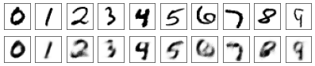
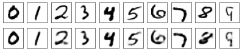
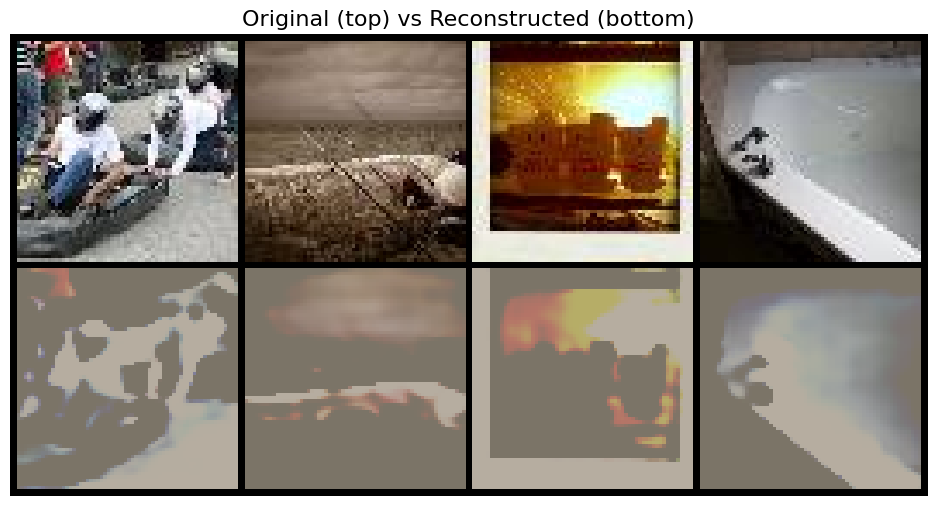
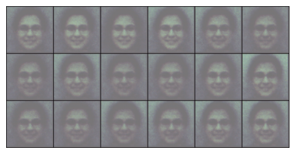
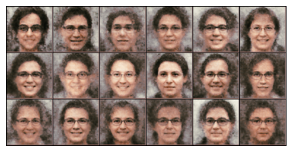
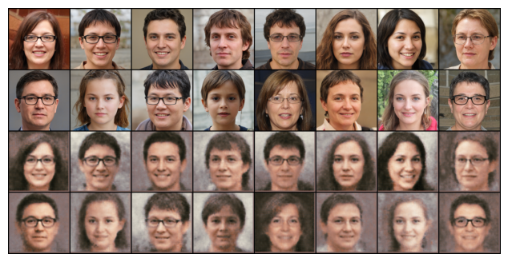

## Autoencoders


This notebook covers

* Autoencoders and variational autoencoders (VAEs) and their differences 
* Building and training an autoencoder from scratch to generate handwritten digits
* Building and training an autoencoder on tinyimagenet dataset
* Building and training a VAE from scratch to generate human face images
* Performing encoding arithmetic with the trained VAE

### What is an autoencoder?

The primary goal of an AE is to learn a compressed representation of the input data, focusing on minimizing the reconstruction error - the difference between the original input and its reconstruction.


### 1. Build and train an autoencoder to generate digits


**1.1 Import libraries and load MNIST data**


```python
import torchvision
import torchvision.transforms as T
import torch
import torch.nn as nn
import torch.nn.functional as F
import matplotlib.pyplot as plt

# determine the device automatically
device="cuda" if torch.cuda.is_available() else "cpu"
```


```python
transform=T.Compose([
    T.ToTensor()])
train_set=torchvision.datasets.MNIST(root=".",
    train=True,download=True,transform=transform) 
test_set=torchvision.datasets.MNIST(root=".",
    train=False,download=True,transform=transform) 

batch_size=32
train_loader=torch.utils.data.DataLoader(
    train_set,batch_size=batch_size,shuffle=True)
test_loader=torch.utils.data.DataLoader(
    test_set,batch_size=batch_size,shuffle=True)
```

**1.2. Build and train an autoencoder**


```python
input_dim = 784
z_dim = 20
h_dim = 200
class AE(nn.Module):
    def __init__(self,input_dim,z_dim,h_dim):
        super().__init__()
        self.common = nn.Linear(input_dim, h_dim)
        self.encoded = nn.Linear(h_dim, z_dim)
        self.l1 = nn.Linear(z_dim, h_dim)
        self.decode = nn.Linear(h_dim, input_dim)                
    def encoder(self, x):
        common = F.relu(self.common(x))
        mu = self.encoded(common)
        return mu
    def decoder(self, z):
        out=F.relu(self.l1(z))
        out=torch.sigmoid(self.decode(out))
        return out
    def forward(self, x):
        mu=self.encoder(x)
        out=self.decoder(mu)
        return out, mu
```


```python
model = AE(input_dim,z_dim,h_dim).to(device)
lr=0.00025
optimizer = torch.optim.Adam(model.parameters(), lr=lr)
```


```python
# collect a sample for each digit
originals = []
idx = 0
for img,label in test_set:
    if label == idx:
        originals.append(img)
        idx += 1
    if idx == 10:
        break

def plot_digits():
    reconstructed=[]
    for idx in range(10):
        # reconstruct the digit image
        with torch.no_grad():
            img = originals[idx].reshape((1,input_dim))
            out,mu = model(img.to(device))
        reconstructed.append(out)
    # Plot both the original and the reconstructed
    imgs=originals+reconstructed
    plt.figure(figsize=(10,2),dpi=50)
    for i in range(20):
        ax = plt.subplot(2,10, i + 1)
        img=(imgs[i]).detach().cpu().numpy()
        plt.imshow(img.reshape(28,28),
                   cmap="binary")
        plt.xticks([])
        plt.yticks([])
    plt.show()  
```


```python
for epoch in range(10):
    tloss=0
    for imgs, labels in train_loader:
        # reconstruct the images
        imgs=imgs.to(device).view(-1, input_dim)
        out, mu=model(imgs)
        # reconstruction loss (MSE)
        loss=((out-imgs)**2).sum()
        optimizer.zero_grad()
        loss.backward()
        optimizer.step()
        tloss+=loss.item()
    print(f"at epoch {epoch} toal loss = {tloss}")
    # visualize the reconstructed digits
    plot_digits()
```

    at epoch 0 toal loss = 1894931.5452270508


    



    at epoch 9 toal loss = 498104.00701904297


    



### 2. Autoencoders on TinyImagenet dataset


```python
from src.tinyimagenet_dataset import get_tinyimagenet_dataloaders
from src.models import get_model, count_parameters
from src.trainer import create_trainer
from src.utils import visualize_reconstructions
```

**2.1 Load the dataset**


```python
train_loader, val_loader = get_tinyimagenet_dataloaders(
        root_dir="../../data", 
        batch_size=32,
        download=True
    )
```

**2.2 Load the convolutional autoencoder**

Summary of the model architecture:

`Encoder`

- 4 Conv2D layers with progressively increasing channels: 3→64→128→256→512
- Downsampling: Each conv layer uses stride=2, reducing spatial dimensions by half each time
- Activation: ReLU + BatchNorm after each conv layer
- Input flow: 3×64×64 → 64×32×32 → 128×16×16 → 256×8×8 → 512×4×4
- Latent projection: Flatten → Linear layer → ReLU (outputs latent_dim=512)

`Decoder`

- Linear projection: latent_dim → 512×4×4, then unflatten to 512×4×4
- 4 ConvTranspose2D layers with decreasing channels: 512→256→128→64→3
- Upsampling: Each transpose conv uses stride=2, doubling spatial dimensions
- Activation: ReLU + BatchNorm for hidden layers, Sigmoid for final output
- Output flow: 512×4×4 → 256×8×8 → 128×16×16 → 64×32×32 → 3×64×64


```python
device = torch.device('cuda' if torch.cuda.is_available() else 'cpu')
print(f"Using device: {device}")

model = get_model('conv', latent_dim=512)
print(f"Model parameters: {count_parameters(model):,}")

model = model.to(device)
```

    Using device: cuda
    Model parameters: 13,912,707


**2.3 Train the model**

Loss Function - Reconstruction Loss
 - We use MSE as our loss function, which is also called as reconstruction loss in the context of autoencoders
    
    MSE = $\frac{1}{n} \Sigma_{i=1}^n({y}-\hat{y})^2$


```python
trainer = create_trainer(model, model_type='standard')
```


```python
trainer.train(
        train_loader=train_loader,
        val_loader=val_loader,
        epochs=50,
        lr=1e-3,
        optimizer_type='adam',
        scheduler_type='step',
        save_dir='checkpoints/conv_autoencoder'
    )
```

    Training autoencoder for 50 epochs on cuda
    Model parameters: 13,912,707

    Epoch 0: 100%|██████████| 3125/3125 [00:27<00:00, 111.88it/s, loss=1.1170]

    Epoch 50/50 - Train Loss: 1.0549, Val Loss: 0.9249
    Final model saved after 50 epochs
    Training completed!


```python
visualize_reconstructions(model, val_loader, device, num_samples=4)
```


    

    


```python
results = trainer.post_training_evaluation(
    val_loader=val_loader,
    save_dir='evaluation_results',
    num_samples=1000
)
```

    Starting comprehensive post-training evaluation...
    
    ==================================================
    VALIDATION SET EVALUATION
    ==================================================
    Computing comprehensive metrics on 1000 samples...


    Evaluating:  10%|█         | 32/313 [00:02<00:25, 11.14it/s]


    
    VALIDATION METRICS:
    ------------------
    MSE:  0.034936 ± 0.025426
    PSNR: 15.88 ± 3.78 dB
    SSIM: 0.6263 ± 0.1571
    LPIPS: 0.2202 ± 0.0255
    FID:  99.37
    
    Latent Space Analysis:
      Dimensions: 512
      Active dims: 368
      Mean activation: 0.7943
      Total variance: 112.4758
    Samples evaluated: 1000
    
    Evaluation results saved to: evaluation_results/comprehensive_evaluation.json
    Evaluation plots saved to: evaluation_results


**2.4 Comment on evaluation metrics**

**Reconstruction Metrics:**

* MSE (0.035): Moderate pixel-level error
* PSNR (15.9 dB): Poor - Well below good threshold of 20+ dB

**Perceptual Metrics:**

* SSIM (0.626): Poor - Below good threshold of 0.8, indicates blurry/distorted reconstructions
* LPIPS (0.220): Poor - High perceptual distance (good is <0.1)

**Distributional Metrics:**

* FID (99.37): Very Poor - Much higher than good threshold of <50

**Latent Space:**

* Utilization (72%): Decent - 368/512 dimensions active
* Activation patterns: Reasonable spread and variance

**Bottom Line:**

The autoencoder struggles with reconstruction quality across all perceptual measures. The latent space utilization is okay, but the model produces blurry, perceptually poor reconstructions that don't match the real data distribution well.

Suggestions: Increase model capacity, adjust loss function (add perceptual losses), or train longer.

### 3. Variational Autoencoders

**Core Concept:**

- Standard AE: Input → Latent Code → Reconstruction
- VAE: Input → Probability Distribution → Sample → Reconstruction

**Key Innovation:**

- Instead of fixed latent codes, learns mean (μ) and variance (σ²)
- Latent space becomes a continuous probability distribution
- Can generate new samples by sampling from learned distribution

**Loss Function:**

- Reconstruction Loss: How well it rebuilds input (MSE/BCE)
- KL Divergence: Forces latent distribution close to N(0,1)
- Total: Loss = Reconstruction + β*KL_divergence

**Benefits:**

- Generative: Can create new samples (unlike standard AE)
- Smooth latent space: Interpolation between points works well
- Regularized: KL loss prevents overfitting to training data

**Key Insight:**

- VAE trades perfect reconstruction for meaningful, structured latent space that enables generation and smooth interpolation.

**3.1. Load glasses dataset**


```python
transform = T.Compose([
            T.Resize(256),
            T.ToTensor(),
            ])
data = torchvision.datasets.ImageFolder(
    root="data/glasses",
    transform=transform)
batch_size=16
loader = torch.utils.data.DataLoader(data,
     batch_size=batch_size,shuffle=True)
```

**3.2 Build a variational autoencoder**


```python
latent_dims=100
class Encoder(nn.Module):
    def __init__(self, latent_dims=100):  
        super().__init__()
        # input 256 by 256 by 3 channels
        self.conv1 = nn.Conv2d(3, 8, 3, stride=2, padding=1)
        # 128 by 128 with 8 channels
        self.conv2 = nn.Conv2d(8, 16, 3, stride=2, padding=1)
        # 64 by 64 with 16 channels
        self.batch2 = nn.BatchNorm2d(16)
        self.conv3 = nn.Conv2d(16, 32, 3, stride=2, padding=0)  
        # 31 by 31 with 32 channels
        self.linear1 = nn.Linear(31*31*32, 1024)
        self.linear2 = nn.Linear(1024, latent_dims)
        self.linear3 = nn.Linear(1024, latent_dims)

        self.N = torch.distributions.Normal(0, 1)
        self.N.loc = self.N.loc.cuda() 
        self.N.scale = self.N.scale.cuda()

    def forward(self, x):
        x = x.to(device)
        x = F.relu(self.conv1(x))
        x = F.relu(self.batch2(self.conv2(x)))
        x = F.relu(self.conv3(x))
        x = torch.flatten(x, start_dim=1)
        x = F.relu(self.linear1(x))
        mu =  self.linear2(x)
        std = torch.exp(self.linear3(x))
        z = mu + std*self.N.sample(mu.shape)
        return mu, std, z  
```


```python
class Decoder(nn.Module):   
    def __init__(self, latent_dims=100):
        super().__init__()
        self.decoder_lin = nn.Sequential(
            nn.Linear(latent_dims, 1024),
            nn.ReLU(True),
            nn.Linear(1024, 31*31*32),
            nn.ReLU(True))
        self.unflatten = nn.Unflatten(dim=1, 
                  unflattened_size=(32,31,31))
        self.decoder_conv = nn.Sequential(
            nn.ConvTranspose2d(32,16,3,stride=2,
                               output_padding=1),
            nn.BatchNorm2d(16),
            nn.ReLU(True),
            nn.ConvTranspose2d(16, 8, 3, stride=2, 
                               padding=1, output_padding=1),
            nn.BatchNorm2d(8),
            nn.ReLU(True),
            nn.ConvTranspose2d(8, 3, 3, stride=2,
                               padding=1, output_padding=1))
        
    def forward(self, x):
        x = self.decoder_lin(x)
        x = self.unflatten(x)
        x = self.decoder_conv(x)
        x = torch.sigmoid(x)
        return x  
```


```python
class VAE(nn.Module):
    def __init__(self, latent_dims=100):
        super().__init__()
        self.encoder = Encoder(latent_dims)
        self.decoder = Decoder(latent_dims)
    def forward(self, x):
        x = x.to(device)
        mu, std, z = self.encoder(x)
        return mu, std, self.decoder(z) 
```


```python
vae=VAE().to(device)
lr=1e-4 
optimizer=torch.optim.Adam(vae.parameters(),
                           lr=lr,weight_decay=1e-5)
```

**3.3. Train the Variational Autoencoder**


```python
def train_epoch(epoch):
    vae.train()
    epoch_loss = 0.0
    for imgs, _ in loader: 
        imgs = imgs.to(device)
        mu, std, out = vae(imgs)
        # reconstruction loss
        reconstruction_loss = ((imgs-out)**2).sum() 
        # kl loss
        kl = ((std**2)/2 + (mu**2)/2 - torch.log(std) - 0.5).sum()
        # total loss
        loss = reconstruction_loss + kl
        # Backward propagation
        optimizer.zero_grad()
        loss.backward()
        optimizer.step()
        # Print batch loss
        epoch_loss+=loss.item()
    print(f'at epoch {epoch}, loss is {epoch_loss}')  
```


```python
import numpy as np
import matplotlib.pyplot as plt

def plot_epoch():
    with torch.no_grad():
        noise = torch.randn(18,latent_dims).to(device)
        imgs = vae.decoder(noise).cpu()
        imgs = torchvision.utils.make_grid(imgs,6,3).numpy()
        fig, ax = plt.subplots(figsize=(6,3),dpi=100)
        plt.imshow(np.transpose(imgs, (1, 2, 0)))
        plt.axis("off")
        plt.show()      
```


```python
for epoch in range(1,11):
    train_epoch(epoch)
    plot_epoch()
torch.save(vae.state_dict(),"files/VAEglasses.pth")    
```

    at epoch 1, loss is 49310821.015625


    



    at epoch 10, loss is 8981061.82421875


    

    


**3.4. Generate Images with the Trained Model**


```python
vae.eval()
vae.load_state_dict(torch.load('files/VAEglasses.pth',
                              map_location=device))
```


```python
# compare original with reconstructed
imgs,_=next(iter(loader))
imgs = imgs.to(device)
mu, std, out = vae(imgs)
images=torch.cat([imgs,out],dim=0).detach().cpu()
images = torchvision.utils.make_grid(images,8,4)
fig, ax = plt.subplots(figsize=(8,4),dpi=100)
plt.imshow(np.transpose(images, (1, 2, 0)))
plt.axis("off")
plt.show()      
```


    

    

