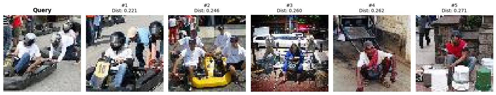
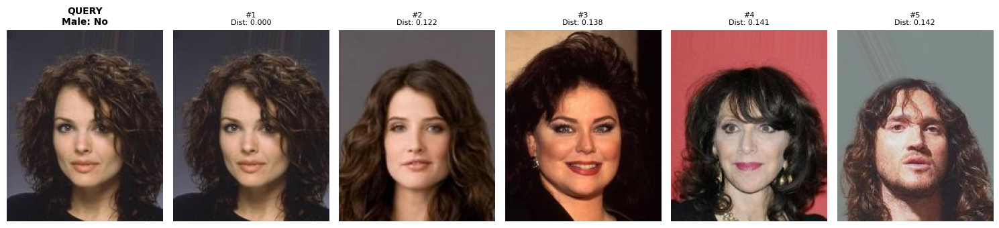

## Visual Search Engine

A comprehensive visual search engine implementation using deep learning and similarity search, built for both general image search and face recognition tasks.

This notebook covers

- **ResNet101 Embeddings**: 2048-dimensional feature vectors from pretrained ImageNet model
- **FAISS Search Index**: Efficient L2 distance similarity search  
- **Prototype with TinyImageNet**: A dataset with 1L images and 200 classes
- **Face Search Extension**: CelebA dataset
- **Comprehensive Evaluation**: Precision@k, Recall@k, mAP metrics

**Import libraries**


```python
from utils import *
import torch
from face_search_extension import CelebADataset, evaluate_face_search, get_face_transforms, face_search_and_visualize

device = torch.device('cuda' if torch.cuda.is_available() else 'cpu')
```

**Load Tiny imagenet dataset**


```python
train_dataset = TinyImageNetDataset("data/tiny-imagenet-200", 'train', get_transforms('train'))
val_dataset = TinyImageNetDataset("data/tiny-imagenet-200", 'val', get_transforms('val'))

train_loader = DataLoader(train_dataset, batch_size=32, shuffle=False)
```

**Load RESNET101 embeddings (2048 dim)**


```python
model = ResNetEmbedder(pretrained=True)
embeddings, labels, paths = extract_embeddings(model, train_loader, device)
```
    Extracting embeddings...


    100%|██████████| 3125/3125 [02:52<00:00, 18.12it/s]


    Extracted 100000 embeddings of dimension 2048


**Build a search index**


```python
index = FAISSIndex()
index.build_index(embeddings, labels, paths)
```

    Building FAISS index...


    Index built with 100000 vectors


**Evaluate search results**


```python
results = evaluate_search_engine(model, index, val_dataset, device, num_queries = 500, k_values = [1, 5, 10])
```

    Evaluating with 500 queries...


    100%|██████████| 500/500 [00:37<00:00, 13.24it/s]


    Precision@1: 0.6460
    Recall@1: 0.0013
    mAP@1: 0.6460
    ------------------------------
    Precision@5: 0.5956
    Recall@5: 0.0060
    mAP@5: 0.6896
    ------------------------------
    Precision@10: 0.5780
    Recall@10: 0.0116
    mAP@10: 0.6678
    ------------------------------


- The recall is very low, due to the fact that the number of samples per class is 500, so the maximum Top-5 recall can be 0.01 (5/500)
- The precision and mAP are under acceptable range, considering we have not fine tuned before extracting the embeddings.

**Visualize Top-5 search results**


```python
query_path = val_dataset.image_paths[0]
search_and_visualize(model, index, query_path, device, k=5)
```


    

    


**Load CelebA face dataset**


```python
# Setup face dataset (requires CelebA download)
face_dataset = CelebADataset('data/img_align_celeba', 'val', get_face_transforms('val'))
face_loader = DataLoader(face_dataset, batch_size=32, shuffle=False)
```

    Loading split information...
    Loading attributes information...
    Using 'Male' as target attribute


    Loaded 19867 images from val split
    Target attribute 'Male' distribution:
      0: 11409 images (57.4%)
      1: 8458 images (42.6%)


**Load RESNET101 embedding and build index**


```python
face_embeddings, face_labels, face_paths = extract_embeddings(model, face_loader, device)
face_index = FAISSIndex()
face_index.build_index(face_embeddings, face_labels, face_paths)
```

    Extracting embeddings...


    100%|██████████| 621/621 [00:42<00:00, 14.52it/s]


    Extracted 19867 embeddings of dimension 2048
    Building FAISS index...
    Index built with 19867 vectors


**Evaluate search results**


```python
face_results = evaluate_face_search(model, face_index, face_dataset, device)
```

    Evaluating face search with 100 queries...

    100%|██████████| 100/100 [00:05<00:00, 19.73it/s]

    Attribute Precision@1: 1.0000
    Attribute Recall@1: 0.0001
    Attribute mAP@1: 1.0000
    ------------------------------
    Attribute Precision@5: 0.9120
    Attribute Recall@5: 0.0005
    Attribute mAP@5: 0.9767
    ------------------------------
    Attribute Precision@10: 0.8980
    Attribute Recall@10: 0.0009
    Attribute mAP@10: 0.9535
    ------------------------------


**Visualize Top-5 search results**


```python
query_path_face = face_dataset.image_paths[0]
face_search_and_visualize(model, face_index, query_path_face, face_dataset, device, k=5)
```
    


